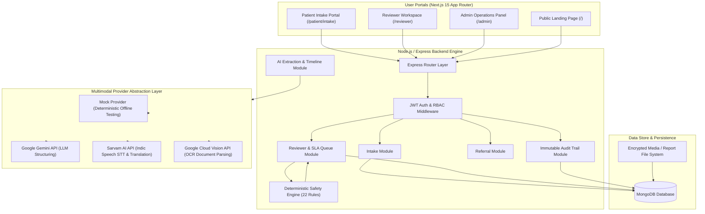

# MedicalTriage

> **Human-in-the-Loop Healthcare Triage Assistant for Resource-Constrained Environments**
> 
> *A non-diagnostic software prototype for government hospitals, Primary Health Centres (PHCs), public health camps, campus clinics, and occupational health units.*

---

## ⚠️ STRICT NON-DIAGNOSTIC & SAFETY BOUNDARY DISCLAIMER

```text
PROTOTYPE / HACKATHON IMPLEMENTATION FOR RESEARCH AND EVALUATION PURPOSES ONLY.

MedicalTriage is a human-in-the-loop information organization system.
It DOES NOT independently diagnose medical conditions, prescribe treatment,
recommend clinical therapies, or make autonomous medical decisions.

It DOES NOT replace qualified healthcare professionals. All outputs are advisory
and require verification and decision-making by qualified medical personnel.

This project has NOT undergone an independent clinical validation, security audit,
medical-device conformity assessment, or regulatory certification.
```

---

## 1. What is MedicalTriage?

In high-volume healthcare environments — such as Primary Health Centres (PHCs) and government hospital outpatient departments (OPDs) in India — medical officers and triage nurses process large numbers of patients presenting with diverse symptoms, regional languages, hand-written or scanned paper lab reports, and verbal complaints.

**MedicalTriage** organizes patient-reported narratives, speech recordings, lab reports (OCR), visual observations, and regional language translations into structured, prioritized reviewer artifacts. It applies a **deterministic safety engine** to highlight potential red flags while enforcing **mandatory qualified human review** for every case.

---

## 2. Problem Statement

1. **Fragmented Patient Narratives**: Patient data arrives across disconnected formats (unstructured text, spoken regional dialects, paper diagnostic reports, physical observations).
2. **Review Queue Bottlenecks**: Healthcare staff lack clear, automated prioritization and operational SLA tracking to manage workload effectively.
3. **Multilingual & Literacy Barriers**: Patients express symptoms in diverse regional languages (e.g., Hindi, Odia, Bengali, Tamil, Gujarati) requiring accurate translation for clinical staff.
4. **Information Completeness Gaps**: Key clinical history (e.g., onset duration, severity, relevant negatives) is often missing at initial presentation.
5. **Over-reliance on Unsafe Autonomous AI**: Naïve medical AI applications risk hallucinating diagnoses or silently downgrading critical emergencies.

---

## 3. Solution Pipeline

MedicalTriage solves these challenges through a strict human-in-the-loop operational architecture:

```text
Patient Self-Intake / Speech / Uploads
               │
               ▼
AI Information Normalization & Multimodal Processing
               │
               ▼
Missing Information Detection & Timeline Assembly
               │
               ▼
Deterministic 22-Rule Safety & Urgency Engine
 (URGENT > PRIORITY > ROUTINE | Fail-Safe to PRIORITY)
               │
               ▼
Reviewer Queue & SLA Operational Tracking
               │
               ▼
Structured Reviewer Workspace (Explicit Provenance Badges)
               │
               ▼
Qualified Human Review & Decision (Override / Accept)
               │
       ┌───────┴───────┐
       ▼               ▼
Inter-facility    Case Resolution /
  Referral        Escalation
       │               │
       └───────┬───────┘
               ▼
   Immutable Audit Trail
```

---

## 4. Key Features

### 🏥 Patient Self-Intake & Multimodal Input
- **Structured Intake**: Multi-step symptom registration with explicit consent capture.
- **Speech-To-Text (STT)**: Audio voice recording upload with automatic transcription.
- **Medical Report OCR**: PDF and image lab report upload with text extraction.
- **Visual Observations**: Image upload for reviewer inspection with structured metadata.
- **Multilingual Support**: Supports Indian regional language translation (Hindi, Odia, Bengali, Tamil, Gujarati) with dual-text side-by-side verification cards.

### 🛡️ Deterministic Safety & Urgency Engine
- **Safety Precedence**: Evaluates cases using 22 deterministic safety rules (`URGENT > PRIORITY > ROUTINE`).
- **Fail-Safe Precedence**: Processing errors, AI timeouts, or schema uncertainties automatically fail-safe to `PRIORITY` (never silent `ROUTINE`).
- **Safe Phrasing**: Routine cases state *"No configured higher-priority review signal detected"* rather than making false health guarantees.

### 📋 Reviewer Workspace & Operational SLA
- **Reviewer Queue**: Real-time queue filtered by priority, SLA status, facility, and status.
- **Operational SLA**: Tracks `PENDING`, `DUE SOON`, `OVERDUE`, and `ESCALATED` SLA timers (`URGENT` = 1h, `PRIORITY` = 4h, `ROUTINE` = 24h).
- **Information Provenance**: Displays explicit badges distinguishing `PATIENT PROVIDED`, `AI GENERATED`, `AI OBSERVATION`, and `HUMAN VERIFIED`.
- **Structured Triage Note**: Automatically compiles chief complaint, symptom log, missing information, OCR findings, and safety flags.
- **Human Decision Workflow**: Reviewers can accept AI suggestions, override priority, record clinical notes, or initiate inter-facility referrals.

### 🔒 Enterprise Governance, Audit & Privacy
- **RBAC & Authorization**: Strict Role-Based Access Control (`PATIENT`, `NURSE`, `HEALTH_WORKER`, `DOCTOR`, `MEDICAL_OFFICER`, `ADMIN`).

- **Facility Isolation**: Multi-tenant data segregation ensuring facility-level privacy.
- **Immutable Audit Trail**: Chronological event tracking logging all intake, extraction, evaluation, review, and referral events.
- **Privacy & Retention**: Automated retention classification (`CLINICAL_CASE`, `MEDIA_BLOB`, `AI_DERIVED`, `AUDIT_LOG`) with purge operations.

---

## 5. System Architecture



---

## 6. Tech Stack

### Frontend
- **Framework**: Next.js 15 (App Router, Server & Client Components)
- **Language**: TypeScript 5.8
- **Styling**: Tailwind CSS, Vanilla CSS, Lucide Icons
- **State & Data**: TanStack Query v5, React Hook Form, Zod
- **Testing**: Playwright End-to-End Test Suite

### Backend
- **Runtime**: Node.js v18+ / v20+
- **Framework**: Express.js
- **Database**: MongoDB 7.0 & Mongoose ODM
- **Security & Logging**: Helmet, CORS, Express Rate Limit, Pino Logger, JWT, bcrypt
- **Testing**: Vitest, Supertest (339 Unit & Integration Tests)

---

## 7. Repository Structure

```text
medicalTriage/
├── backend/
│   ├── src/
│   │   ├── config/             # Environment, Database, & System Configuration
│   │   ├── middleware/         # Auth, Error Handling, Rate Limiting, Request Logging
│   │   ├── modules/            # Domain Modules (Auth, Intake, Reviewer, Safety, SLA, etc.)
│   │   ├── seed/               # Synthetic Dataset Generators & Seed Runner
│   │   ├── app.ts              # Express Application Setup
│   │   └── server.ts           # HTTP Server Initialization
│   ├── tests/                  # 24 Vitest Integration Test Suites (339 Tests)
│   └── package.json
│
├── frontend/
│   ├── e2e/                    # Playwright Golden End-to-End Tests
│   ├── src/
│   │   ├── app/                # Next.js App Router Pages (/, /login, /patient, /reviewer, /admin)
│   │   ├── components/         # UI Components (Reviewer, Admin, Modals, Banners)
│   │   └── lib/                # API Client Utilities & Constants
│   ├── playwright.config.ts    # Playwright Runner Config
│   └── package.json
│
├── docs/                       # Comprehensive Architecture & System Documentation (30+ Docs)
├── docker-compose.yml          # Local Infrastructure Compose (MongoDB)
├── .env.example                # Unified Environment Variable Template
└── README.md                   # Primary Developer & Evaluator Documentation
```

---

## 8. Quick Start Guide

### Prerequisites
- **Node.js**: v18.0.0+ or v20.0.0+
- **MongoDB**: Local MongoDB on port `27017` or Docker MongoDB container (`docker compose up -d mongo`)

### 1. Setup Environment
Copy `.env.example` to `.env` in the root folder:
```bash
cp .env.example .env
```

### 2. Install Dependencies
```bash
# Install backend dependencies
cd backend
npm install

# Install frontend dependencies
cd ../frontend
npm install
```

### 3. Seed Synthetic Demo Data
Populate MongoDB with deterministic synthetic patients, cases, reviewers, facilities, and audit entries:
```bash
cd backend
npm run seed:test-data
```

### 4. Start Development Servers

**Backend Engine** (Runs on `http://localhost:5000`):
```bash
cd backend
npm run dev
```

**Frontend Application** (Runs on `http://localhost:3000`):
```bash
cd frontend
npm run dev
```

---

## 9. Synthetic Demo Credentials

All test personas use legitimate authentication and RBAC. Password for all seeded accounts:

**Default Password**: `Password123!`

| Role | Email | Name | Facility | Primary Scope |
| :--- | :--- | :--- | :--- | :--- |
| **Reviewer (Doctor)** | `doctor@example.com` | Dr. Aris Thorne | SCB Medical College | Queue, Case Detail, Overrides, Referrals |
| **Reviewer (Nurse)** | `nurse@example.com` | Nurse Sarah Jenkins | Cuttack District Hospital | Queue, Triage Note, Escalations |
| **Patient** | `patient@example.com` | Synthetic Patient | N/A | Intake Submission, Self Case Status |
| **Admin** | `admin@example.com` | System Admin | All Facilities | Facility Management, Audit Logs, Retention |

---

## 10. Automated Testing Suite

### Backend Integration Test Suite (Vitest)
```bash
cd backend
npm test
```
*Executes 339 automated unit, integration, safety regression, security, and provider tests across 24 test files.*

### Backend TypeScript Build
```bash
cd backend
npm run build
```

### Frontend Code Quality & Linting
```bash
cd frontend
npm run lint
```

### Frontend Production Build
```bash
cd frontend
npm run build
```

### Playwright Golden End-to-End Spec
```bash
cd frontend
npx playwright test
```
*Executes canonical multi-role E2E tests validating the complete flow from landing page to patient intake, doctor queue inspection, safety evaluation, triage note verification, human review, and audit logging.*

---

## 11. Documentation Sitemap

Detailed architectural and technical documentation is maintained in the [`docs/`](./docs/) directory:

- 📘 [Product Requirements](./docs/product-requirements.md) — Comprehensive product goals and constraints.
- 🛡️ [Safety & Urgency Engine](./docs/safety-urgency-engine.md) — 22-rule safety engine and fail-safe logic.
- 🔒 [Security Hardening](./docs/security-hardening.md) — Implemented RBAC, input validation, and security controls.
- 📡 [API Specification](./docs/api.md) — Complete REST API endpoint documentation.
- 🏗️ [System Architecture](./docs/architecture.md) — Module architecture, data flows, and design decisions.
- 🗄️ [Database & Data Models](./docs/database.md) — MongoDB schemas and indexes.
- 🎯 [Hackathon Evaluation Mapping](./docs/hackathon-evaluation.md) — Alignment with hackathon evaluation criteria.
- 🎬 [Demo Guide & Script](./docs/demo-guide.md) — Step-by-step hackathon demo presentation script.
- 🧪 [Testing Strategy](./docs/testing-strategy.md) — Test suite layout, coverage details, and E2E setup.
- ⚠️ [Prototype Limitations](./docs/limitations.md) — Technical and operational prototype limitations.
- 🚀 [Production Deployment Notes](./docs/deployment.md) — Production infrastructure guidelines.
- 📑 [Release Checklist](./docs/release-checklist.md) — Complete release verification checklist.

---

## 12. License & Legal Disclaimer

MedicalTriage is created as a non-diagnostic prototype for hackathon evaluation and healthcare research purposes. See [docs/safety.md](./docs/safety.md) for full clinical boundary disclosures.
