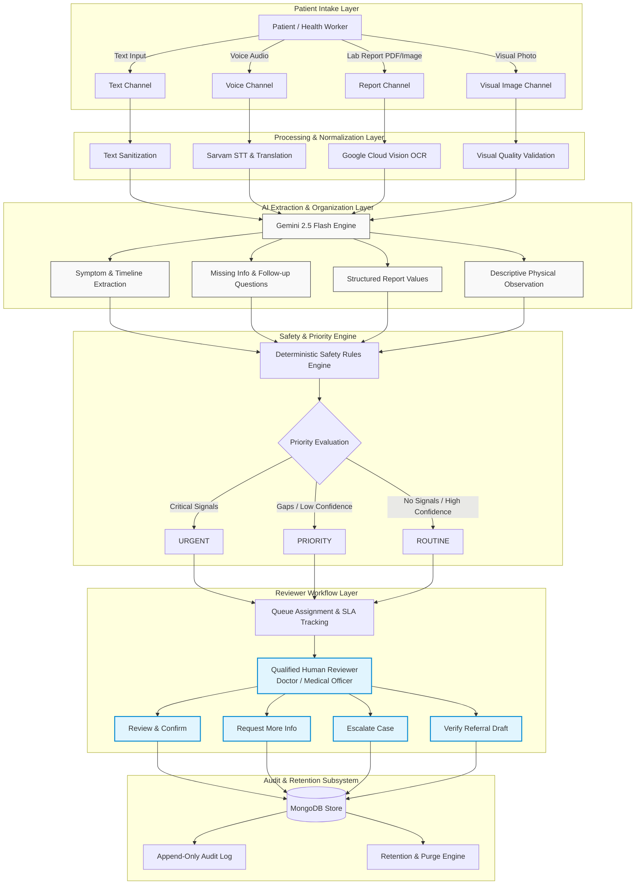

# Healthcare Triage Assistant — System Architecture Document (Phase 0)

> [!NOTE]
> **Architectural Contract**: This document defines the system topology, component interactions, input processing pipelines, state machines, and security architecture for the **Healthcare Triage Assistant**. All future implementation phases MUST strictly align with this architecture.

---

## 1. High-Level Conceptual Architecture

The diagram below illustrates the end-to-end flow from patient input through AI-assisted organization, safety evaluation, human review, workflow execution, audit logging, and data retention.



---

## 2. Component Subsystems & Responsibilities

### 2.1 Web Frontend Subsystem (`frontend/`)
- **Technology**: Next.js 15+ (App Router), TypeScript, Tailwind CSS, shadcn/ui.
- **State & Data Handling**: React Hook Form, TanStack Query, Zod validation schemas.
- **Key Modules**:
  - **Patient Intake Portal**: Multilingual text/voice recorder, drag-and-drop report/image uploader, follow-up questionnaire.
  - **Reviewer Dashboard**: Live color-coded case queue (`URGENT` red, `PRIORITY` yellow, `ROUTINE` blue), ESI-style filter bar, SLA countdown timer badges.
  - **Case Detail View**: Structured clinical summary note, raw provenance inspector, interactive report viewer, visual observation display, referral draft editor.

### 2.2 Application Backend API Subsystem (`backend/`)
- **Technology**: Node.js, Express, TypeScript, Zod schema validation.
- **Security & Middleware**: JWT authentication, backend RBAC authorization, Helmet HTTP protection, `express-rate-limit`, Pino logger.
- **Key Services**:
  - `AuthService`: Authentication, password hashing, JWT issue/verify, RBAC permission checks.
  - `CaseService`: Case CRUD, status state machine transitions, referral draft management.
  - `TriageService`: Coordinates AI pipelines, prompt formatting, confidence calculation.
  - `SafetyEngine`: Deterministic rule evaluator for workflow risk signals and fail-safe fallbacks.
  - `AssignmentEngine`: Facility-aware reviewer queue assignment and SLA monitoring.
  - `AuditService`: Immutable event logging for system compliance.

### 2.3 Database Layer (`MongoDB & Mongoose`)
- **Technology**: MongoDB with Mongoose ORM.
- **Core Collections**:
  - `users`: Credentials, roles (`PATIENT`, `HEALTH_WORKER`, `DOCTOR`, `ADMIN`), facility IDs.
  - `facilities`: Facility details (`GOVERNMENT_HOSPITAL`, `PHC`, `PUBLIC_HEALTH_CAMP`, etc.), SLA thresholds.
  - `cases`: Comprehensive case record including raw input references, AI extractions, priority, status, and assignment.
  - `audit_logs`: Immutable audit records tracking event, user, timestamp, and provenance metadata.

### 2.4 External AI Provider Integrations (Server-Side Only)
- **Google Gemini 2.5 Flash**: Orchestrates structured symptom extraction, timeline summarization, missing info detection, follow-up question generation, and referral drafting via server-side REST API calls.
- **Sarvam AI**: Handles Speech-to-Text (STT) and translation/normalization for Hindi and future regional languages.
- **Google Cloud Vision OCR**: Extracts raw text blocks and tables from uploaded lab report images/PDFs.

---

## 3. Multi-Channel Input Processing Pipelines

### 3.1 Text Processing Pipeline
```
[User Text Input]
  │
  ▼
[Backend Input Validation (Zod)]
  │
  ▼
[Language Identification]
  │
  ▼ (If Non-English e.g., Hindi)
[Sarvam Translation / Normalization]
  │
  ▼
[Gemini Extraction Prompt] ──► [Structured JSON Summary]
```

### 3.2 Voice Processing Pipeline
```
[Audio Recording (WAV/WebM)]
  │
  ▼
[Backend File Security & Size Check]
  │
  ▼
[Sarvam STT Pipeline] ──► [Raw Transcript + Confidence Score]
  │
  ▼
[Sarvam Language Normalization] ──► [English Normalized Text]
  │
  ▼
[Gemini Extraction Prompt] ──► [Structured Case Note]
```

### 3.3 Medical Report Processing Pipeline
```
[Uploaded Lab Report (PDF/PNG)]
  │
  ▼
[MIME-Type Whitelist & Security Scan]
  │
  ▼
[Google Cloud Vision OCR] ──► [Extracted Text Blocks & Tables]
  │
  ▼
[Gemini Structuring Prompt] ──► [Parsed Lab Values + Normal Ranges]
  │
  ▼ (If Low Confidence or Parse Error)
[Flag for Manual Reviewer Verification] ──► [Set PRIORITY]
```

### 3.4 Visual Image Processing Pipeline
```
[Uploaded Clinical Image (JPEG/PNG)]
  │
  ▼
[Image Quality & Illumination Validation]
  │
  ▼
[Gemini 2.5 Flash Vision Model]
  │
  ▼
[Descriptive Physical Observation Output (Non-Diagnostic)]
  │
  ▼
[Safety Rules Engine Evaluation] ──► [Review Priority Assignment]
```

---

## 4. Case Lifecycle State Machine

The case lifecycle enforces valid state transitions to guarantee human oversight:

| Current State | Allowed Next State | Transition Trigger / Action | Authorized Role |
| :--- | :--- | :--- | :--- |
| `DRAFT` | `SUBMITTED` | Patient submits completed intake form. | `PATIENT`, `HEALTH_WORKER` |
| `SUBMITTED` | `PROCESSING` | Backend picks up case for AI pipeline processing. | `SYSTEM` |
| `PROCESSING` | `READY_FOR_REVIEW` | AI extraction and safety rules engine complete. | `SYSTEM` |
| `READY_FOR_REVIEW` | `ASSIGNED` | Manual or auto assignment to reviewer queue. | `SYSTEM`, `ADMIN`, `DOCTOR` |
| `ASSIGNED` | `ACKNOWLEDGED` | Reviewer views case in active reviewer queue. | `DOCTOR`, `HEALTH_WORKER` |
| `ACKNOWLEDGED` | `UNDER_REVIEW` | Reviewer opens detailed case review screen. | `DOCTOR`, `HEALTH_WORKER` |
| `UNDER_REVIEW` | `REVIEWED` | Reviewer confirms case note and approves summary. | `DOCTOR`, `HEALTH_WORKER` |
| `UNDER_REVIEW` | `MORE_INFO` | Reviewer triggers follow-up question request. | `DOCTOR`, `HEALTH_WORKER` |
| `MORE_INFO` | `UNDER_REVIEW` | Patient provides required additional details. | `PATIENT`, `HEALTH_WORKER` |
| `UNDER_REVIEW` | `ESCALATED` | Reviewer escalates case due to complexity/acuity. | `DOCTOR`, `HEALTH_WORKER` |
| `UNDER_REVIEW` | `REFERRED` | Reviewer approves and issues referral draft. | `DOCTOR` |
| `REVIEWED` / `REFERRED` | `COMPLETED` | Final disposition action logged and case closed. | `DOCTOR`, `ADMIN` |

---

## 5. SLA & Escalation Engine Architecture

Cases track workflow deadlines to ensure timely human review:

$$\text{SLA Deadline} = \text{Case Submitted Timestamp} + \text{Facility SLA Window (by Priority)}$$

- **Default SLA Windows**:
  - `URGENT`: **15 minutes** to acknowledgment / review.
  - `PRIORITY`: **60 minutes** to acknowledgment / review.
  - `ROUTINE`: **240 minutes** (4 hours) to acknowledgment / review.

### SLA Timeout & Escalation Lifecycle
```
[Case ASSIGNED] ──► [SLA Countdown Timer Started]
                         │
                         ├───────► [Reviewer Acknowledges] ──► [Timer Cleared]
                         │
                         ▼ (SLA Deadline Expired)
             [Event: SLA_EXPIRED]
                         │
                         ▼
             [Trigger Auto-Escalation] ──► [Reassign to Lead Reviewer / Escalate Priority]
```

---

## 6. Audit Logging & Retention Subsystem

### 6.1 Audit Log Data Schema
```typescript
interface AuditLogEntry {
  id: string;
  caseId: string;
  eventType: 
    | 'CASE_CREATED' | 'CONSENT_RECORDED' | 'REPORT_UPLOADED' | 'OCR_COMPLETED'
    | 'VOICE_TRANSCRIBED' | 'IMAGE_ANALYZED' | 'AI_SUMMARY_GENERATED'
    | 'SAFETY_FLAG_CREATED' | 'CASE_ASSIGNED' | 'CASE_ACKNOWLEDGED'
    | 'SLA_WARNING' | 'SLA_EXPIRED' | 'CASE_ESCALATED' | 'REVIEWER_EDITED'
    | 'REFERRAL_CREATED' | 'CASE_COMPLETED' | 'CASE_PURGED';
  performedBy: {
    userId: string;
    role: 'PATIENT' | 'HEALTH_WORKER' | 'DOCTOR' | 'ADMIN' | 'SYSTEM';
  };
  provenance: 'PATIENT-PROVIDED' | 'AI-GENERATED' | 'SYSTEM-GENERATED' | 'REVIEWER-CORRECTED' | 'REVIEWER-AUTHORED';
  details: Record<string, unknown>; // Non-sensitive context metadata
  timestamp: Date;
}
```

### 6.2 Data Retention & Purging Sequence
1. **Retention Trigger**: A background process monitors completed cases against the configured retention period (`expiresAt`).
2. **Content Purge**: Purges raw text entries, voice audio binaries, uploaded report PDFs, and visual images.
3. **Anonymization**: Replaces case patient references with anonymized retention tags.
4. **Audit Preservation**: Retains the corresponding `AuditLogEntry` records permanently for compliance.

---

## 7. Security & Secret Management Architecture

1. **Server-Side API Key Protection**: Provider API keys (`GEMINI_API_KEY`, `SARVAM_API_KEY`, `GOOGLE_APPLICATION_CREDENTIALS`) are strictly loaded via process environment variables on the backend Node.js server. **No client-side exposure is permitted.**
2. **Network Security**:
   - `Helmet` middleware sets security headers (CSP, HSTS, X-Frame-Options).
   - Rate limiting via `express-rate-limit` prevents brute-force abuse on public endpoints (e.g., max 100 requests / 15 min per IP).
3. **Access Control**: JWT bearer tokens encode user identity, role, and facility scope. Endpoints enforce strict middleware authorization (`authorizeRole(['DOCTOR', 'ADMIN'])`).
